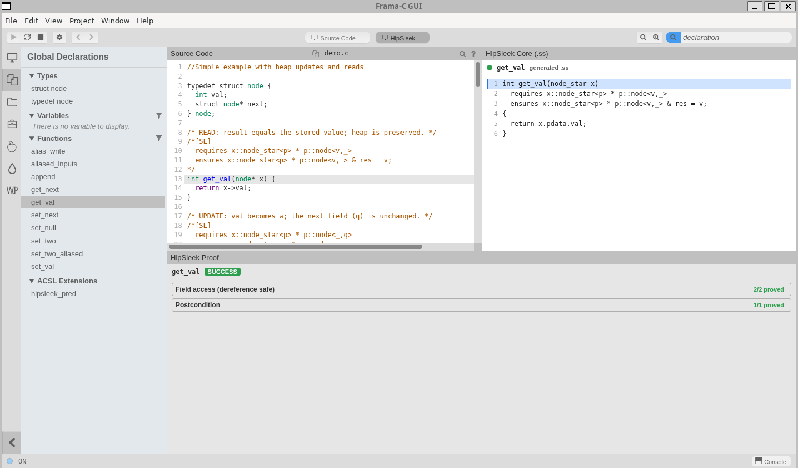
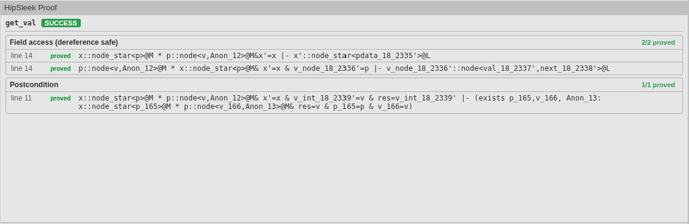
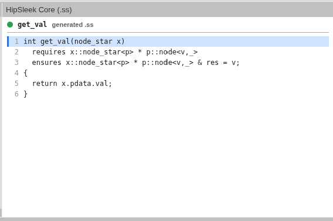
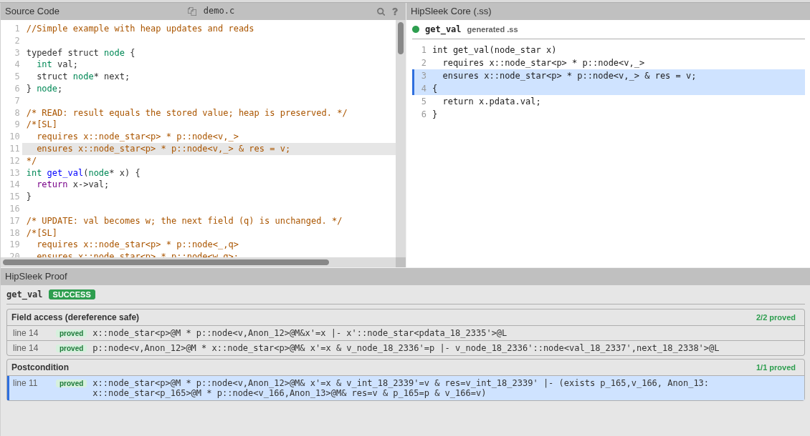

# HipSleek Verification via Frama-C

This directory contains demo programs for the Frama-C HipSleek plugin, which lets you verify C programs using separation-logic specifications processed by the HipSleek engine (`hip.exe`).

## Build

From the repository root:

```bash
dune build
```

This builds both Frama-C (with the HipSleek plugin) and the `hip.exe` / `sleek.exe` binaries.

## Run

```bash
dune exec --root . frama-c -- -hipsleek <file.c>
```

Example:

```bash
dune exec --root . frama-c -- -hipsleek demo_hipsleek/test_ll.c
```

Expected output:

```
[hipsleek] [HipSleek] append: SUCCESS
[hipsleek] [HipSleek] length: SUCCESS
```

## GUI (Ivette)

The dev tree's graphical front-end is **Ivette** (an Electron app). It ships a dedicated
**HipSleek** view that puts your C source, the generated HipSleek `.ss` program, and the
proof obligations side by side, all cross-linked.

### One-time setup

Ivette needs **Node >= 20** and is built with `yarn`/`make`:

```bash
nvm use 23                # or any Node >= 20
yarn install              # in the repo root
make -C ivette api        # regenerate the TypeScript server API
make -C ivette app        # produces the bin/frama-c-gui launcher
```

Re-run `make -C ivette api` after changing a plugin's server requests, and
`make -C ivette app` after any change to the Ivette TypeScript.

### Running

```bash
nvm use 23
unset ELECTRON_RUN_AS_NODE         # else Electron runs headless -> "ipcMain undefined"
export ELECTRON_DISABLE_SANDBOX=1  # WSL/sandbox-less environments

HIP=$(pwd)/_build/default/hipsleek/hip.exe
bin/frama-c-gui -hipsleek -hipsleek-proof-log -hipsleek-path "$HIP" demo_hipsleek/test_ll.c
```

Pass `-hipsleek-proof-log` so the **HipSleek Proof** panel is populated with obligations
(without it you still get the verdict, but no per-obligation detail).

Notes:
- Any arguments after `bin/frama-c-gui` are passed straight to `frama-c`.
- Give it about 20 s after the window opens to connect. The dev server is slow to bind its
  socket on the Windows-mounted `/mnt/c` filesystem, so the functions list is briefly empty.
- Do not prefix the launch with `pkill` in the same command, that races the spawn. Kill any
  stale instance as a separate step first.

### Opening the HipSleek panels

The HipSleek panels are registered both as a ready-made **view** (a one-click layout) and as
individual **components** you can dock anywhere. Open them from the sidebar:

1. Make sure the sidebar is visible. Click **View** in the top menu bar and choose
   **Toggle Sidebar** (or press `Ctrl/Cmd+B`), or click the icons on the left edge of the
   window.
2. To open the whole layout at once, select the **Views** sidebar tab and click **HipSleek**.
3. To add one panel at a time, select the **Components** sidebar tab, type `hipsleek` in the
   filter box, and click the component you want:
   - **HipSleek Proof** (the obligations panel), or
   - **HipSleek Core (.ss)** (the generated `.ss` program).

### The HipSleek view

After the window connects, choose the **HipSleek** view as described above. It is a
three-panel layout:

| Panel | Location | Shows |
|-------|----------|-------|
| **Source Code** | top-left | your original C file, including the `/*[SL]*/` and `/*[SL_loop]*/` spec comments |
| **HipSleek Core (.ss)** | top-right | the separation-logic program the plugin generates and feeds to `hip.exe` |
| **HipSleek Proof** | bottom | the per-function verdict and proof obligations |

Select a function (from the Source Code view, the `.ss` view, or the Globals list) to
populate all three panels for it.



> The normalized AST view is still available. Add it from the components menu if you want
> it back alongside or instead of the `.ss` view.

#### HipSleek Proof panel

Shows the selected function's verdict (a colored badge) followed by its proof obligations,
grouped by kind:

- `PRE` (precondition), `BIND` (a field access / dereference is safe), `PRE_REC` (the
  precondition at a recursive call), and `POST` (postcondition).
- Each row shows the C source line it comes from, a green `proved` / red `unproved` badge,
  and the (decluttered) entailment. Groups open automatically when they contain an unproved
  obligation or the currently selected line.

Obligations only appear when you launched with `-hipsleek-proof-log`.



#### HipSleek Core (.ss) panel

Shows the generated `.ss` for the selected function: the actual program the verdict and
obligations are about. A status circle next to the function name reflects the HipSleek
verdict (green = SUCCESS, yellow = unknown, red = FAIL or ERROR). Each line is numbered and
clickable.



#### Cross-linking the panels

Everything is keyed by C source line, so clicking in one panel highlights the matching place
in the others:

- Click a line in the **.ss** view to highlight its C source line and the obligations from it.
- Click an **obligation** to highlight its C source line and its `.ss` line.
- Select a line in the **Source Code** view to highlight the matching `.ss` line(s) and
  obligations.

This works for spec comment lines too. For example, clicking a `POST` obligation reveals the
`ensures` line inside the `/*[SL]*/` (or `/*[SL_loop]*/`) comment, even though comments have
no AST marker.



## Annotation Syntax

All HipSleek annotations are written as special C comments so the file remains valid C. Three kinds are supported:

### 1. Predicate / view definitions: `/*[SL_pred] ... */`

Defines separation-logic predicates used in specs. Written at the top of the file (before any function that uses them).

```c
/*[SL_pred]
ll<> == self = null
  or self::node_star<p> * p::node<_,q> * q::ll<>;
*/
```

The body is HipSleek's native `.ss` view syntax and is passed through verbatim to the generated `.ss` file.

### 2. Pre/post specifications: `/*[SL] ... */`

Written immediately before the function they annotate.

```c
/*[SL]
  requires x::ll<> * y::ll<>
  ensures res::ll<>;
*/
node* append(node* x, node* y) { ... }
```

### 3. Loop specifications: `/*[SL_loop] ... */`

A `while` loop needs its own contract, written in a `/*[SL_loop]*/` block placed immediately
before the loop. HipSleek desugars the loop into a recursive helper and verifies it against
this spec. Use primed variables (`i'`) for a variable's post-state and unprimed (`i`) for its
value on entry:

```c
int count_to_ten(int i) {
  /*[SL_loop]
     requires true
     ensures i < 10 & i' = 10 or i >= 10 & i' = i;
  */
  while (i < 10) {
    i = i + 1;
  }
  return i;
}
```

You only write the `requires` / `ensures`. The plugin recovers the loop guard from Frama-C's
normalized form automatically. A loop with no `/*[SL_loop]*/` block still translates, but
HipSleek may reject it, and the plugin emits a fidelity warning in that case. See
`demo_hipsleek/loop.c` for the full demo. Its verdict looks like:

```
[hipsleek] [HipSleek] while loop at line 10 (in count_to_ten): SUCCESS
[hipsleek] [HipSleek] count_to_ten: SUCCESS
```

The first line is the loop itself (HipSleek's desugared helper, relabeled with the loop's C
source line); the second is the enclosing function.

## Pointer types and field access

HipSleek's native format represents C pointer types `T*` as a wrapper type `T_star` with a single field `pdata`. The plugin performs this translation automatically:

| C source | Generated `.ss` |
|----------|----------------|
| `node* x` (parameter) | `node_star x` |
| `x->next` | `x.pdata.next` |
| `struct node { node* next; }` | `data node { node_star next; }` + `data node_star { node pdata; }` |
| `(node*)0` / `NULL` | `null` |

Predicate definitions must use `node_star` directly (as shown in the `ll<>` example above), since they are passed through verbatim.

## Example: `test_ll.c`

```c
/*[SL_pred]
ll<> == self = null
  or self::node_star<p> * p::node<_,q> * q::ll<>;
*/

typedef struct node {
  int val;
  struct node* next;
} node;

/*[SL]
  requires x::ll<>
  ensures x::ll<>;
*/
int length(node* x) {
  if (x == 0) return 0;
  return 1 + length(x->next);
}

/*[SL]
  requires x::ll<> * y::ll<>
  ensures res::ll<>;
*/
node* append(node* x, node* y) {
  if (x == 0) return y;
  x->next = append(x->next, y);
  return x;
}
```

## Verification results in Frama-C

Each function's HipSleek verdict is reported back into Frama-C as a real property,
so it shows up on the command line, in `-report`, and in the Ivette GUI:

- The SL spec appears on the function as a clean `\hipsleek::hipsleek requires…/ensures…`
  contract clause (visible with `-print` and in the GUI source view), and the SUCCESS/FAIL
  verdict becomes that clause's **property status** (green *Valid* marker on SUCCESS).
- `[SL_pred]` view definitions appear as a global `\hipsleek::hipsleek_pred …` annotation.

### Proof detail: `-hipsleek-proof-log`

With this flag, the plugin runs HipSleek with its ESL proof log enabled and attaches the
per-function proof obligations (the SLEEK entailments: `PRE` / `POST` / `BIND` / `PRE_REC`,
each marked `[proved]` / `[unproved]`) as a **separate `HipSleek proof (…)` property** on the
function. This keeps the source comment clean: the detail is shown on demand (in `-report`,
or by selecting the function in the GUI's Properties panel), not inline in the contract.

```bash
dune exec --root . frama-c -- \
  -hipsleek -hipsleek-proof-log demo_hipsleek/test_ll.c -report -report-print-properties
```

### Translation-fidelity warnings

The C→`.ss` translation supports a subset of C. When a function body uses something that is
dropped or approximated (a cast, a global variable, `sizeof`, `switch`, `goto`, a nested
lvalue, …), the plugin emits a warning such as:

```
[hipsleek] Warning: uses_global: generated .ss may differ from your C (references global 'g')
```

so a green verdict on a lossily-translated function is never silent.

## Options

| Flag | Description |
|------|-------------|
| `-hipsleek` | Enable the HipSleek plugin |
| `-hipsleek-path <path>` | Override path to `hip.exe` (auto-detected by default) |
| `-hipsleek-output-dir <dir>` | Directory for the generated `.ss` file (default: system temp) |
| `-hipsleek-proof-log` | Capture HipSleek's ESL proof log and attach per-function proof detail as a property |
